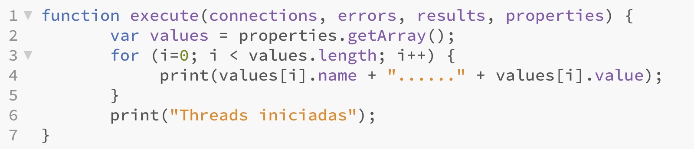
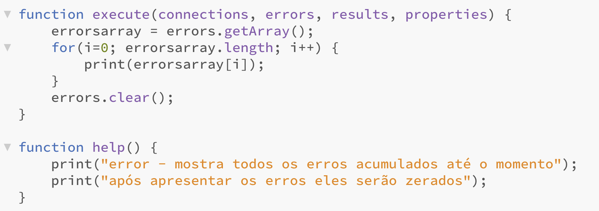
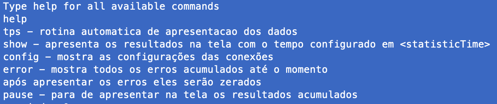

# Nível 1 - somente executar 

Baixar todos os arquivos em um diretório 

## Criar uma instância de MQ na máquina
Pode ser feito com o comando  

<li>docker volume qm1data</li>
<li>docker run --name mqdemo --env LICENSE=accept --env MQ_QMGR_NAME=QM1 --env MQ_ENABLE_METRICS=true --env MQ_ENABLE_EMBEDDED_WEB_SERVER=true --env MQ_ADMIN_PASSWORD=passw0rd --env MQ_APP_PASSWORD=passw0rd --volume qm1data:/mnt/mqm --publish 1414:1414 --publish 9009:9443 --publish 9157:9157 --detach ibmcom/mq</li>

## este utiliza a imagem aberta de demo do MQ no Docker.hub, e aponta para uma persistência externa (--volume)
## ou

<li>docker volume qm1data</li>
<li>docker run --name mqdemo --env LICENSE=accept --env MQ_QMGR_NAME=QM1 --env MQ_ENABLE_METRICS=true --env MQ_ENABLE_EMBEDDED_WEB_SERVER=true --publish 1414:1414 --publish 9009:9443 --publish 9157:9157 --detach icr.io/ibm-messaging/mq</li>

Depois é só abrir um command prompt e executar ./gmequer.sh ou gmequer.bat (depende do sistema operacional)
Ele já está configurado para apontar para o IP loopback e as configurações default do comando docker acima
---------------------------------------------------------------------------------------------------------------
# Nivel 2 - Mudar configurações (gmequer.properties)

## Alterar o arquivo gmequer.properties
## informations from sender
hostNameSender=127.0.0.1
hostPortSender=1414
channelNameSender=DEV.APP.SVRCONN
queueManagerNameSender=QM1
queueNameSender=DEV.QUEUE.1
usernameSender=app
passwordSender=passw0rd
persistent=false
sleepTimeSender=10
messageSizing=100
messagePattern=helloworld
numThreadsSender=5

## informations from receiver
hostNameReceiver=127.0.0.1
hostPortReceiver=1414
channelNameReceiver=DEV.APP.SVRCONN
queueManagerNameReceiver=QM1
queueNameReceiver=DEV.QUEUE.1
usernameReceiver=app
passwordReceiver=passw0rd
sleepTimeReceiver=10
numThreadsReceiver=5

## general informations
statisticTime=5
scripts=default

# Opções :
1. hostName*, hostPort*, channelName*, queueManager*, queueName*, userName* e userPassword* são as configurações do MQ 
2. messageSizing - tamanho da mensagem - ela será criada concatenando suscessivamente o parametro messagePattern abaixo
3. messagePattern* - usado para criar a mensagem
4. numThreadsSender e numThreadsReceiver - numero de threads para envio e recepção
7. sleepTime* - tempo em milissegundos que o programa dorme antes de enviar ou ler outra mensagem
8. persistent - true se a mensagem é persistente ou false se não persistente
9. statisticTime - Tempo em segundos para apresentar as estatísticas na tela (apresenta no formato do arquivo loop.js)
10. scripts - diretório que contém os scripts de inicialização, finalização e de execução no loop do programa
---------------------------------------------------------------------------------------------------------------
# Nivel 3 - Editar formato de saída
São fornecidos ttres arquivos para a formatação da saída
<li> initialization.js
<li> finalization.js
<li> loop.js
Os dois primeiros executados uma única vez, no início e no final respecttivamente
O último é chamado a cada vez que for executado o statistic time parâmetro
Ele precisa tem um formato : 

  
Todos os objetos passados como parâmetros tem um método getArray(), que retorna um objeto estático e um método clear(), que limpa a coleção (quando for pertinente)

### Cada elemento do objeto connections contém (qualquer um pode ser impresso na tela
  public JmsFactoryFactory factory;
	public JmsConnectionFactory jmsFactory;
	public javax.jms.Connection connection;
	public Session session;
	public Queue queue;
	public TextMessage textMessage;
	public MessageProducer producer;
	public MessageConsumer consumer;
### Cada elemento do objeto errors é uma instância de Exception em java
### Cada elemento do objeto results contém o resultado de um envio ou recepção, com os campos
  	public int messageSize;  
	  public boolean isProducer; //(se foi enviado ou recebido)
	  public long timestamp;   // timestamp em milissegundos do envio
    public long processTime;  // tempo para enviar ou receber
### Cada uma das propriedades que foram carregadas, no formato 
    public String name;
    public String value;
## dicas - A rotina de inicialização pode escrever o preambulo, por exemplo se for um HTML ou CSV o header, e a rotina finalization pode escrever a finalização, talvez fechar o body ou HTML. A rotina loop.js escreve os valores, com os separadores necessários
---------------------------------------------------------------------------------------------------------------
# Nivel 4 - Criar comandos
  Você pode criar seus comandos e colocar em no diretório commands
  Eles tem o formato
  
  Um método help, onde você põe um print do que o comando faz. Quando você digita help com o programa em execução, ele busca por todos os scripts no diretório commands e executa esta explicação. aparece algo assim 
  
  E um método execute que você pode colocar a lógica que desejar - neste exemplo está imprimindo todos os Exceptions na tela, e depois limpa a lista de erros
  ---------------------------------------------------------------------------------------------------------------
# Nivel 5 - Compilar os códigos 
Eu não forneci um projeto java, mas bastta importar tudo que estiver no diretório src para um IDE (ex eclipse) e importar todos os JARs acima para o classpath (EXCETUANDO-SE O GMEQUER.JAR, que será gerado pela compilação)

  
